# CantoTrack

An issue tracker with time tracking, for teams that plan their work and bill
their hours — from a handful of people to several teams across many projects
and clients. Work is broken down into
**projects → epics → tickets**, planned on boards and in sprints, and the hours
that go into it are logged against the tickets, handed in a week at a time,
approved, and added up for invoicing.

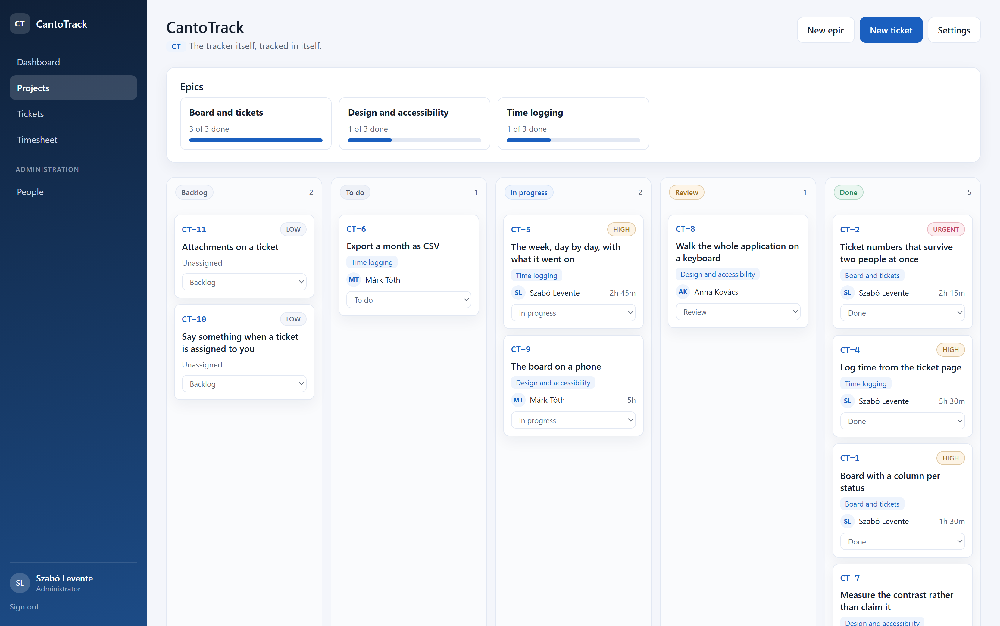

Written in PHP 8.4 with Twig and MariaDB/MySQL. No framework: a router, a
handful of core classes, services that every way in goes through — the forms,
the JSON API and the integrations alike — and a stylesheet built by
concatenating its own sources. Small enough to read in an afternoon, and to
deploy with `git pull`.

## What it does

### Planning

- **Projects, epics and tickets.** A ticket is a task, a bug or a story, with a
  priority, labels, story points, an estimate and a due date. Ticket numbers
  are per project (`CT-4`, `WEB-3`) and come from a counter raised in the same
  transaction as the insert, so two people creating a ticket at the same moment
  cannot end up with the same one.
- **A board per project**, with the project's own columns, WIP limits, and
  swimlanes by person or epic. Cards are dragged between columns — and every
  card also has a select, so the board works on a phone and on a keyboard too.
  What a card shows is the project's choice. A click on a card opens the
  ticket in a panel beside the board, where everything about it can be
  changed without leaving it.
- **A workflow of the project's own**: which column a ticket may move to from
  which (say, nothing to Done without a review), with the columns it may not go
  to greyed out while a card is dragged. A finished ticket says why it is —
  done, won't do, duplicate, cannot be reproduced.
- **Backlog and sprints.** A sprint writes down what it committed to when it
  starts; closing it hands the unfinished work on to the next one. Each sprint
  has a burndown, and each board a velocity chart — drawn on the server as
  SVG, so there is no charting library.
- **Shared boards**, for a team that works on several projects at once: a
  board holds any projects (and, if it likes, a query narrowing them —
  `labels = fejlesztés`), and its sprints hold their tickets together, as in
  Jira. Its columns are its projects' by name — "In progress" in two projects
  is one column — or its own, with each project's statuses put in them; a
  card dropped in one goes to its own project's status there. Every project
  keeps a board of its own, and one sprint can run on each board at a time.
- **Subtasks**, one level deep: a ticket broken into steps, each with its own
  person, column and hours. The parent shows how many are done and what the
  whole of it cost, and its subtasks follow it into its epic and its sprints.
- **Releases**: what goes out together, and the day it is meant to. Each shows
  how much of it is done; sending one out moves what is unfinished on to the
  next, and its release notes — what was finished, as new, fixed and changed —
  are written from the tickets, ready to be copied.
- **A roadmap**, one project's or every project's at once: the epics as bars
  across six months, filled as far as their tickets are done, with the
  releases and the sprints above them. A bar is dragged to move an epic, or by
  an end to change when it starts or finishes; an epic without days of its own
  is drawn from its tickets, and says so.
- **Epics talked about like tickets**: comments with `@` mentions, files, a
  history of what changed, followers who hear when one is commented on or
  finished, and its title, description and days changed where they are
  shown — beside how far its tickets have got, their points and their hours.
- **Fields of a project's own** — text, a number, a choice from a list, a day,
  yes or no — kept by the administrators, required if need be, and on the
  ticket form, its page, its history, the query language
  (`"Platform" = iOS AND Budget > 500`), the API and the CSV import.
- **Templates and repeating tickets**: a project's templates — a bug report
  with its headings, a release checklist with its steps as subtasks — offered
  on the new-ticket form, which they fill in; and tickets made from a
  template by themselves, every working day, every week on a weekday or every
  month on a day, with an assignee and a due date, `{month}` or `{date}` in
  the title filled in. A day the server missed is made up once, not once a
  day.
- **Links between tickets** — blocks, relates to, duplicates. A ticket blocked by
  an unfinished one says so on the board.
- **Private projects and guests.** A project is open to the team, or private to
  the people added to it. A guest — somebody from the client — sees only the
  projects they were added to, and can read and comment but not change the work.

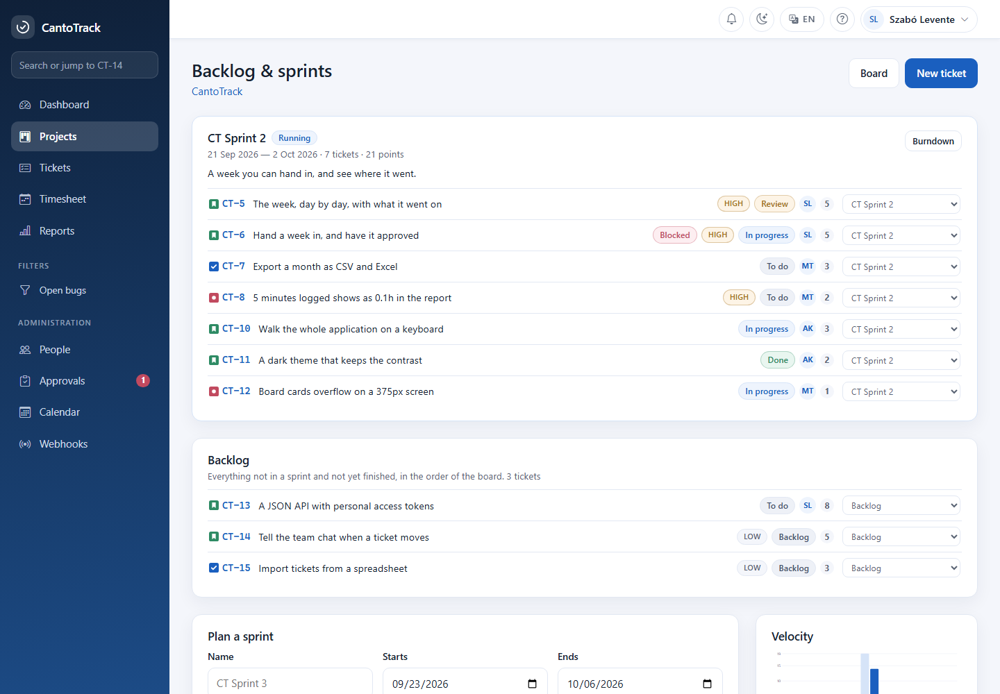

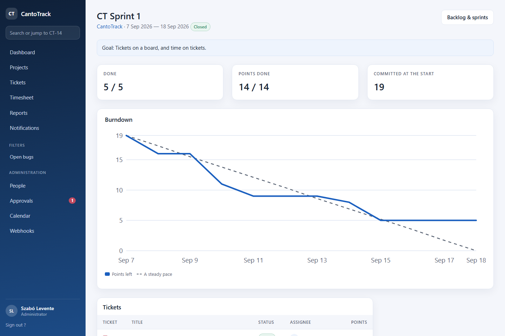

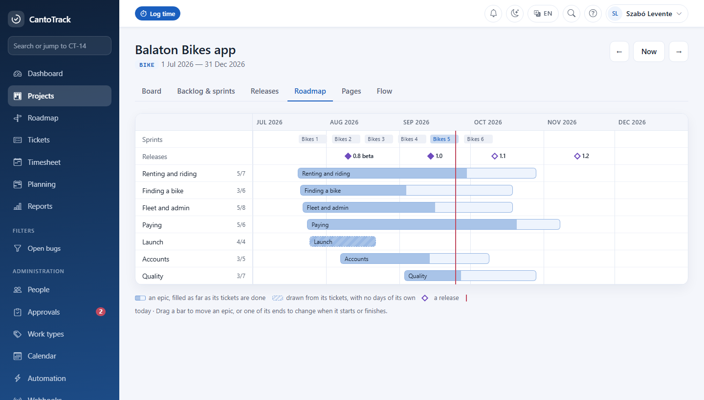

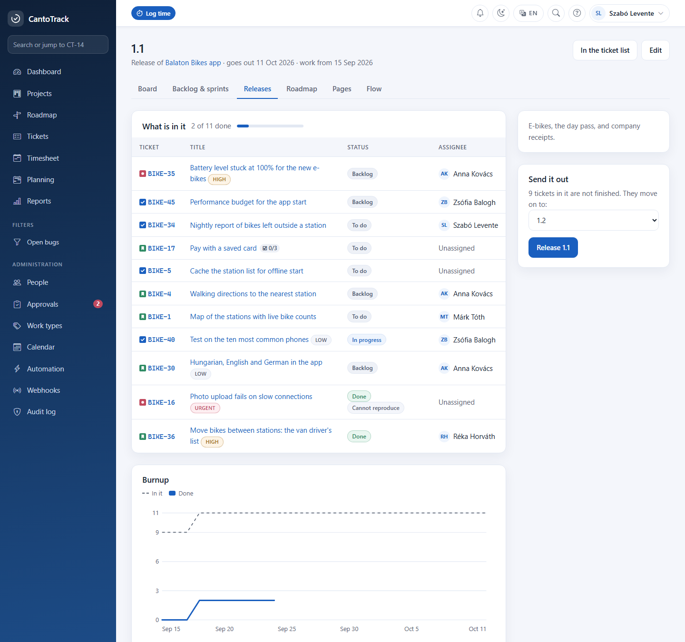

- **How the work flows**, per project: a cumulative flow of what was waiting,
  under way and done each day; how long tickets took from starting and from
  being written down, with the time 85 of every 100 were done within; and what
  came in against what went out, week by week. A release shows its burnup.

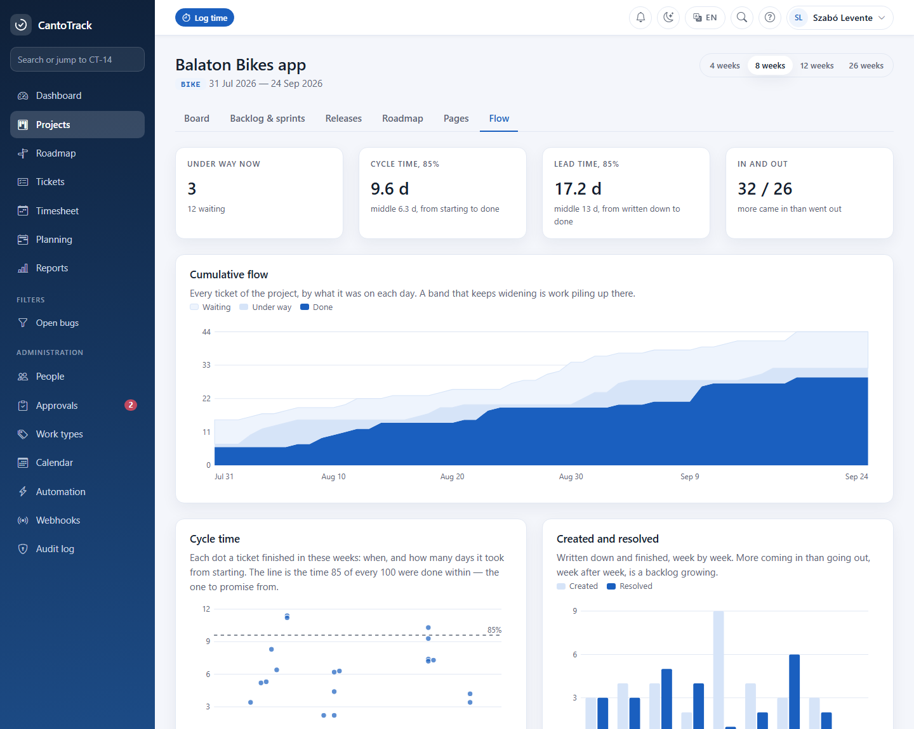

### What the team knows

- **Pages** for every project, in a tree as deep as it needs: how the project
  runs, what was decided and why, the notes of every release. Markdown, with
  `[[links to other pages]]`, ticket keys that link themselves, and lines like
  `{{tickets project = BIKE AND category != done}}` that list those tickets,
  read fresh every time the page is.
- Every save keeps the version before it, a stale edit is refused rather than
  written over somebody else's, and any version can be brought back. A ticket
  says which pages write about it, and a release's notes become a page in
  one click.
- A page starts empty or from a template — meeting notes, a decision, a
  retrospective, a how-to; a picture pasted into it is kept with it; and
  everybody who can read it can comment under it.

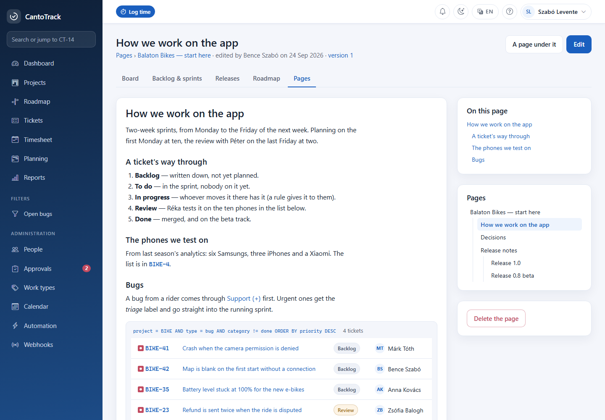

### Talking about the work

- **Comments in Markdown**, with task lists, `@mentions` that notify, and ticket
  keys (`CT-14`) that link themselves; typing `@` offers the people, `#` or the
  start of a key the tickets. A screenshot pasted into a comment is attached
  to the ticket, and a deleted comment can be taken back for a few minutes.
- **Every fact of a ticket is changed where it is shown** — its title, its
  description, its assignee, its due date — and the history below says so. A
  ticket can be cloned into a new one that knows where it came from.
- **Search by words** with a full-text index over tickets, their comments and
  the pages, the best match first and the words marked where they were found.
- **Every change is in the ticket's history**, written in words ("moved it from
  In progress to Review"), next to the comments or on its own.
- **Notifications** in the application and by email, to the people who follow a
  ticket — which anybody who creates, comments on or is given a ticket does —
  and never about a ticket in a project they cannot see. Each person chooses,
  for each kind of thing, both ways, in the application only, or not at all, and
  can ask for a digest of their own query on working-day mornings. The bell
  opens on the newest few and asks every minute what is new: the count follows
  on it and in the tab's title, a new one pops up in the corner, and — for
  somebody who switches them on — the browser's own notifications say so in a
  tab left in the background. An email waits a couple of minutes, so a
  ticket's changes and comments of those minutes arrive as one message, and
  what was read in the meantime is left out. The notifications page narrows
  to the unread ones, a kind or a project, folds one ticket's run of them
  together, and marks each read or unread; a ticket can be muted, by its
  reporter and assignee too, and a mention or being given it still gets
  through.
- **A query language** for the ticket list, the API and the search box —
  `project = BIKE AND assignee = me AND category != done ORDER BY priority DESC`,
  `sprint IN openSprints() AND labels IS EMPTY`, `due < startOfDay()` — with
  suggestions as it is typed, and a mistake pointed at where it is. Every value
  is a bound parameter, and a query can only narrow what somebody may see.
- **Saved filters**, private or shared with the team, and a ticket list that
  filters into the URL, so a list can be bookmarked or sent to somebody. The
  ticket, people and client lists sort by a click on a column header —
  ascending, descending, then back to the list's own order — and the order is
  part of the URL too.
- **Bulk changes** from the ticket list, **CSV import** of tickets from a
  spreadsheet (columns recognised by name, in English or Hungarian, with a
  preview of every row before anything is made), and keyboard shortcuts (`?`
  lists them).

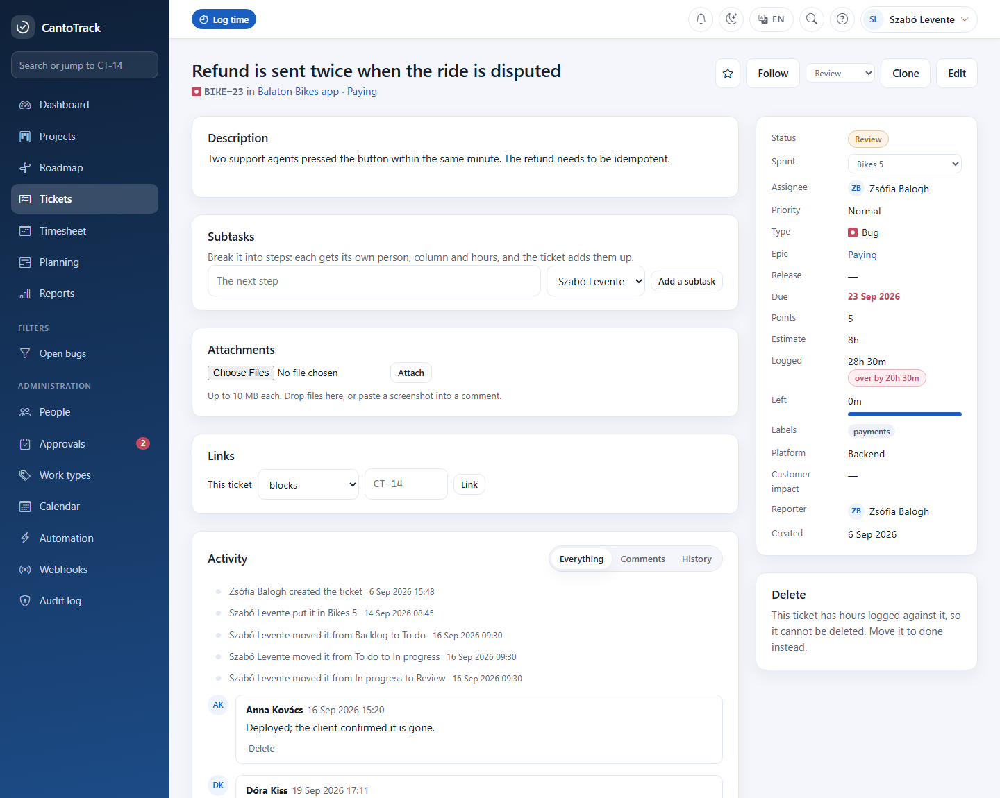

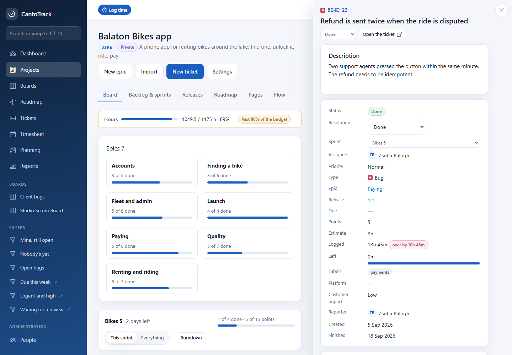

### A dashboard of one's own

- **Made of pieces**: the numbers, one's own open tickets, one's week, the
  sprints and releases coming, what was starred and looked at lately, what
  happened — and pieces of one's own, each a query shown as the tickets it
  finds, how many there are, or how they split by a field.
- **Customized by dragging** pieces within and between two columns, or with
  their arrows from the keyboard; a piece is taken off, put back, or changed
  in place. The customizing mode explains itself and offers ready-made pieces.
  Only the pieces on the page are read.

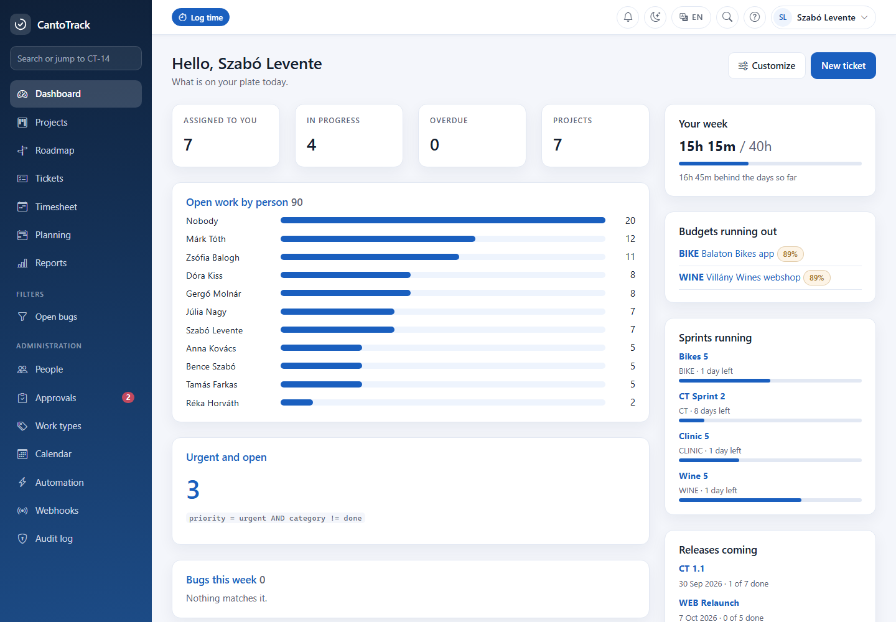

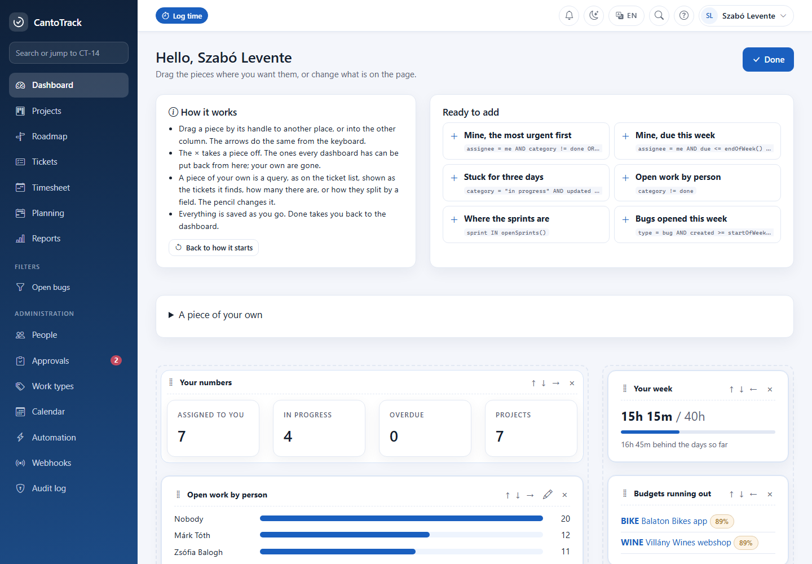

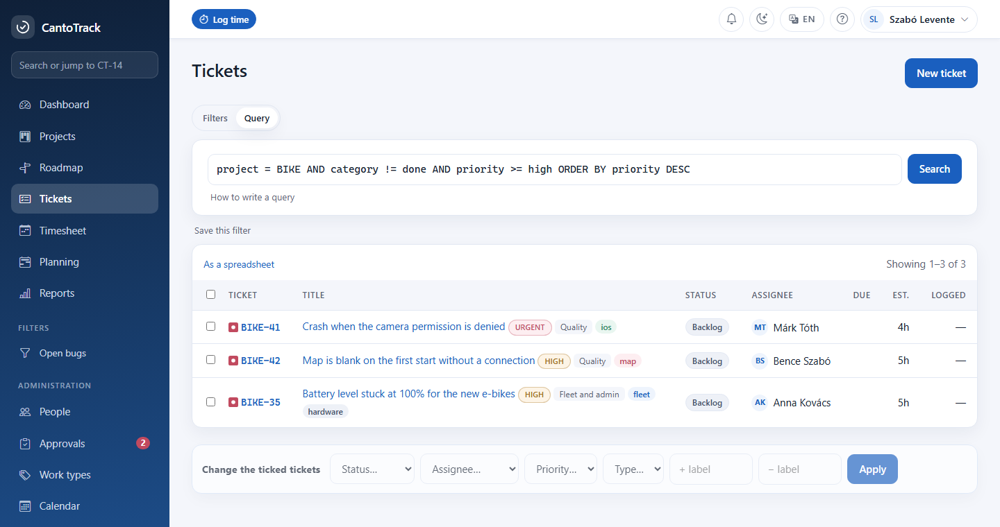

### Time

- **Logged where the work was**: on the ticket, on the day it happened — which
  is rarely the day it is typed in. Durations are written the way people say
  them: `1h 30m`, `90m`, `1.5h`, `1:30` or `1d 2h`. The remaining estimate goes
  down as time is logged, and a timer turns a running stretch into an entry.
  **Log time** in the top bar (or `l`) logs on any ticket from any page, with
  starred and recently worked-on tickets offered first.
- **The week** as a calendar of the hours, day by day, or as a grid of tickets
  by days that can be typed straight into. On the calendar entries sit where
  they started and are dragged to another hour or day, stretched by their edge,
  or opened with a click; dragging over an empty stretch logs it. Any week is a
  pick of a date away. Each day is measured against the
  person's own working week, and a public holiday or a day away is not a short
  day — it says what it is. Last week's tickets come back to the grid in one
  click.
- **One's own calendar**, read from its private iCal address (Google, Outlook
  or anything else that publishes one): the week's meetings show up on the
  calendar, and a click turns one into an entry.
- **Work types** — development, design, a meeting — set by an administrator,
  chosen per entry, and a way to split the reports.
- **The team's week** on one page, every day of every person against their own
  week, and **the missing hours**: who logged less than their working days over
  a stretch, and by how much.
- **Planning**: hours a day on a ticket or a project for a stretch of days, next
  to what each person can work and what they have logged since.
- **Handing a week in**: a handed-in week's hours stop changing until an
  administrator approves it or sends it back with a reason. A lock date closes
  everything before it — for the month that has been invoiced.
- **Billable or not**, by project default or per entry, with clients on the
  projects; **reports** by project, person, client, ticket, work type or day, exported as
  CSV (safe to open in Excel: formulas are neutralised) or as a real `.xlsx`.
- **Rates and budgets**: an hourly rate per person, or the one agreed for a
  project; a project's budget in hours, in money or both, shown as used under
  its tabs and on the administrators' dashboard once past its warning. The
  reports say what the billable hours are worth, to the administrators.
- **Billing a month**: the clients with billable hours not yet billed, and a
  statement for each in one click — a draft first, to check, correct and
  word, then issued: numbered within the year, its rates written down so a
  later raise does not change it, and its hours closed. It is downloaded as
  a PDF (a draft says it is one across every page) or a spreadsheet,
  printed straight from the browser, and read by the client's own guests. An hour goes on one statement only, and
  one issued by mistake is opened again and reissued under its number.
- **Clients**, each with a page of its own: its billing address, tax number,
  contact and a note — what its statements are addressed to — beside its
  projects, its billable hours this month and last, and its statements.
- **One's own dates in one's calendar**: a private address a calendar
  subscribes to, with the days one's tickets are due, the releases coming and
  the sprints' last days.

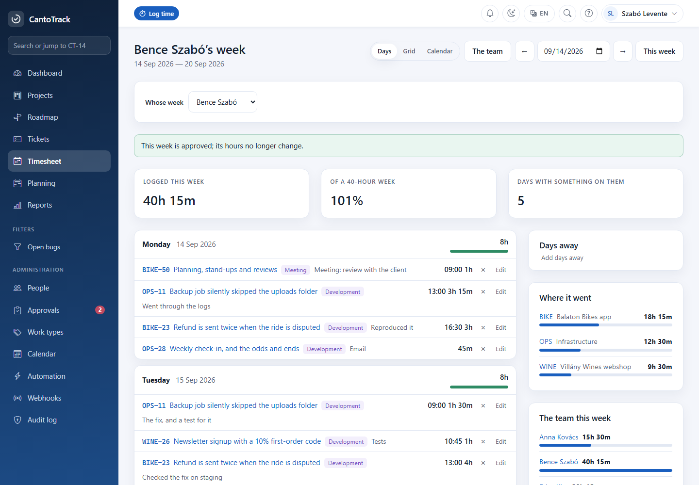

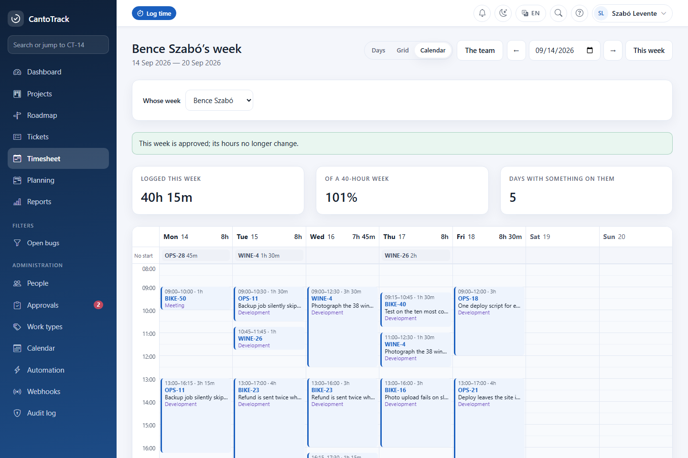

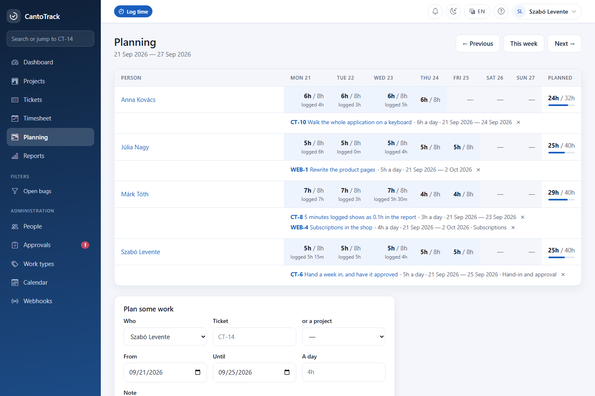

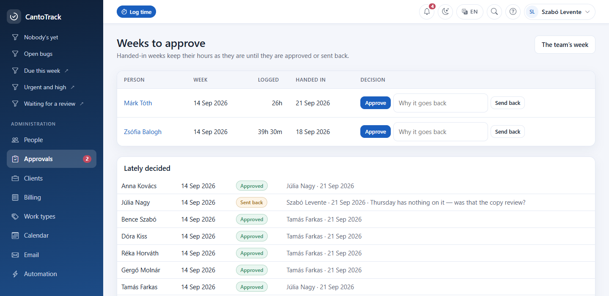

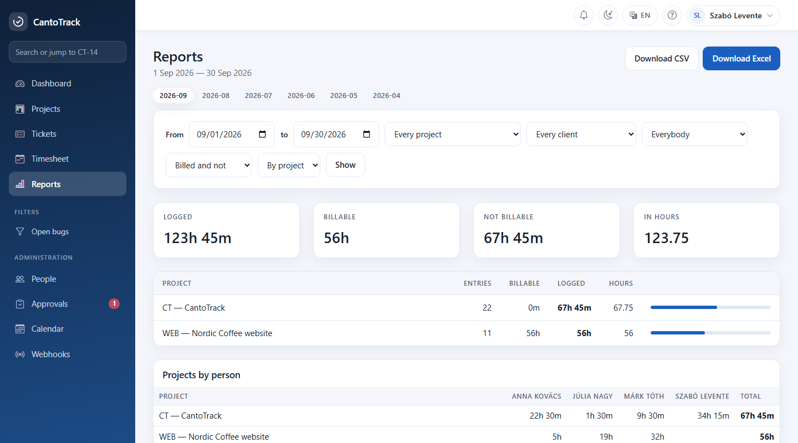

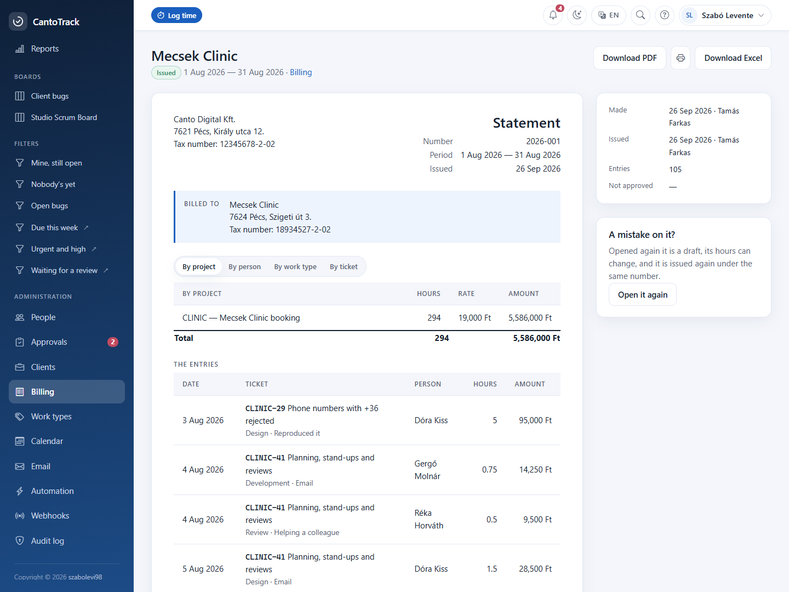

### Automation

- **Rules** that do the small things nobody should have to remember: when a
  ticket is created, moved, given to somebody, changed, linked, commented on,
  logged against, or its last subtask is done — or every morning — and it
  matches a condition in the query language, move it, resolve it, give it to
  somebody, set its priority, due date or a field of the project's own, add or
  take off a label, have somebody follow it, comment, add a subtask, or put it
  in the running sprint (`active`, or `active: Board name` for a shared
  board's).
- A rule answers what happened, never another rule, so two rules cannot undo
  each other for ever; its lines in a ticket's history name it, and its log
  says what it did and what failed.

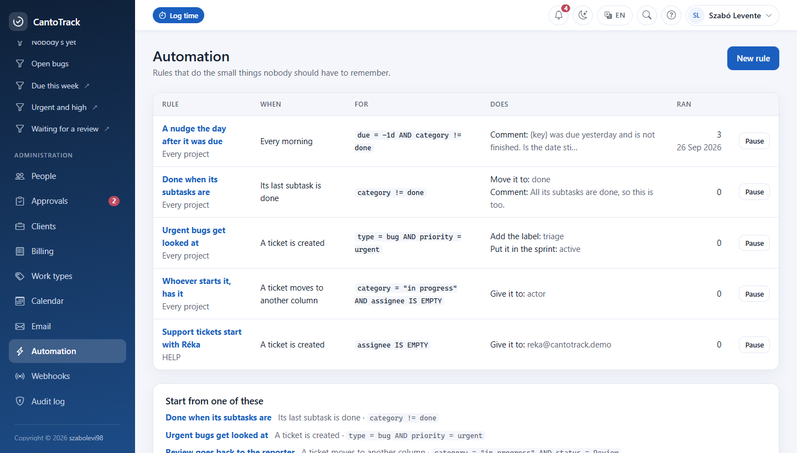

### For other programs

- **A JSON API** under `/api/v1`, with personal access tokens made on the
  profile — see [The API](#the-api) below.
- **Webhooks**: signed messages about every change, to any address outside the
  server's own network, retried with backoff when the other end is down, with a
  log of every delivery that can be resent.
- **GitHub**: a push that names a ticket (`CT-14`) puts the commit into the
  ticket's history, and `Fixes CT-14` on the default branch moves it to done.

### The rest

- **English and Hungarian** throughout, chosen per person — every sentence has
  its translation, and CI refuses a sentence that does not.
- **A dark theme**, or the system's, with the same contrast figures as the light
  one (every text on its background at least 4.5:1).
- **Two-step sign-in** with an authenticator app (TOTP) and single-use recovery
  codes; profile pictures; passwords reset by email with a link that works once.
- **Three roles** — administrator, member, guest — and nobody ever deleted:
  people are deactivated, because tickets and hours point at them. A member can
  **lead a project**: run its columns, members and fields without being an
  administrator.
- **An audit log** of who did what to the installation — sign-ins and failed
  ones, passwords and two-step sign-in, people, project settings and members,
  deleted work, rules and webhooks — with when, from where and what changed.
- **Ctrl+K** jumps anywhere: a ticket, a page or a project by a few of its words,
  what was opened lately, or something there is a shortcut for.
- **Email** through PHP's own `mail()` or an SMTP server, chosen in the
  configuration.

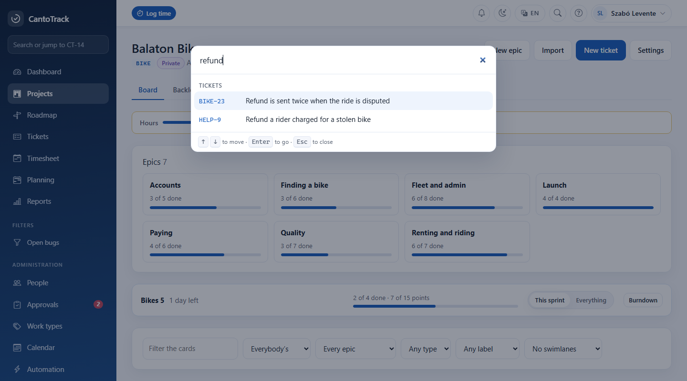

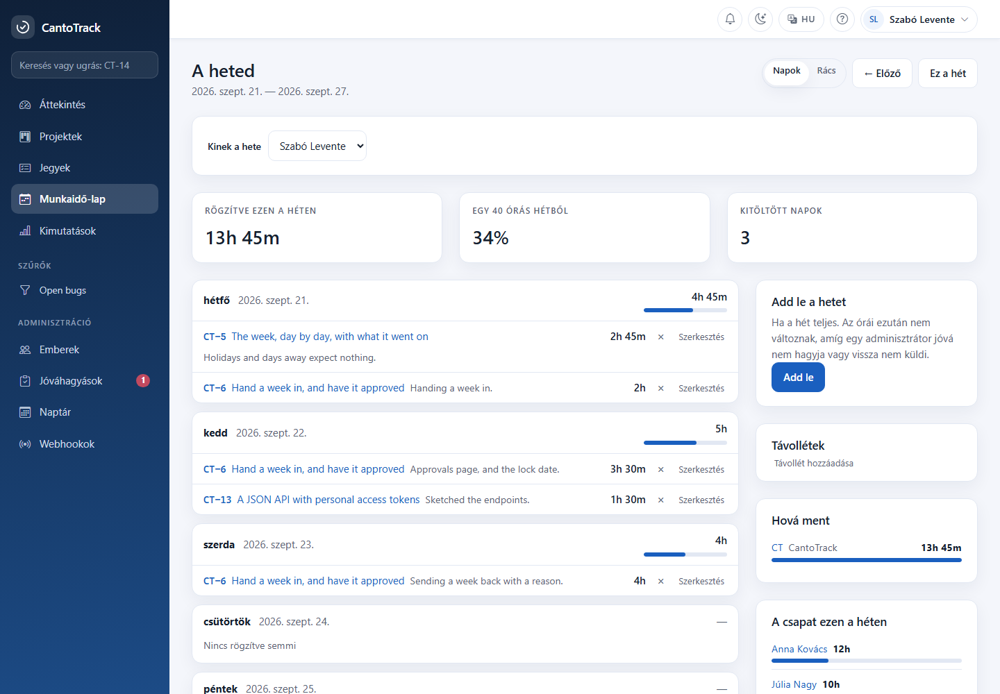

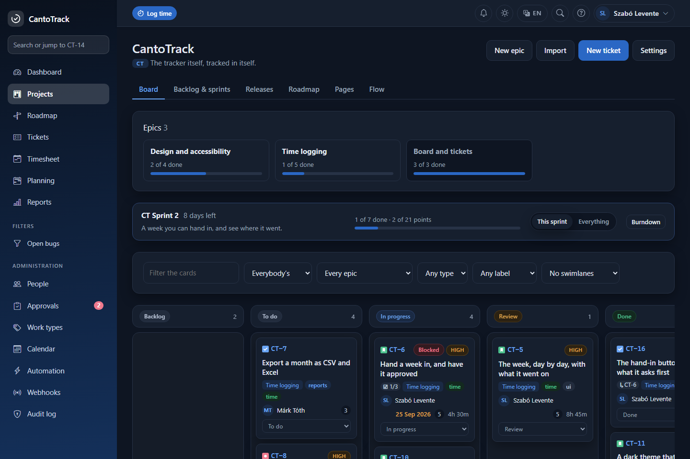

## Security, in short

- A Content-Security-Policy of `script-src 'self'`: there is no inline script or
  event handler anywhere, so text that got onto a page cannot run.
- One CSRF gate for every form post; the API and the integrations carry no
  session at all and prove themselves with a token or a signature.
- Passwords with bcrypt at cost 12; a wrong address and a wrong password take
  the same time to answer; sign-in, token and code attempts are throttled.
- Hidden projects are filtered where the rows are read, so a ticket somebody
  cannot see is simply not there — on a page, in a search or in the API.
- Uploads are checked by content, not by name, and served so a browser cannot
  run them; webhook addresses are checked against private and reserved ranges,
  and the checked address is the one connected to.

## Running it

Needs PHP 8.4 (with `curl`, `fileinfo`, `gd`, `iconv`, `mbstring`, `pdo_mysql`
and `zip`), MariaDB or MySQL, and a web server whose document root is the `web/`
folder.

```
composer install
cp config/config.ini.dist config/config.ini   # then fill in the database and the address
php database/migrate.php                       # creates the tables, and later brings them up to date
php database/seed.php                          # the first administrator, with a printed password
```

Then open the application and sign in with what the seed printed. `app.base_url`
in `config.ini` has to be the address the application is opened at, because
every link is built from it. The built stylesheet and script are committed; after
changing their sources, `php bin/build_assets.php` builds them again.

Email goes out the way `[mail] transport` says: `mail` for PHP's own `mail()`
through the machine's sendmail, `smtp` for a mail server (`host`, `port`,
`username`, `password`, `encryption`), `file` to write every message to
`var/mail` while developing, or `none`. It is not sent while somebody waits
for their page: it goes into an outbox, and the outbox job sends it within
the minute and tries again — later each time, for about five hours — what
the mail server refuses. The administrators' **Email** page shows what is
waiting, what did not go and why, and sends a test message. The link for a
lost password is the exception, and goes at once.

Cron, for email and webhooks every minute, the daily automation rules, and
the morning digests people ask for on their profile:

```
* * * * * www-data php /path/to/cantotrack/bin/outbox.php
* * * * * www-data php /path/to/cantotrack/bin/webhooks.php
15 7 * * * www-data php /path/to/cantotrack/bin/automation.php
30 7 * * 1-5 www-data php /path/to/cantotrack/bin/digest.php
```

The webhook job sends what is waiting and retries what failed. Under PHP-FPM a
request sends its own messages after answering; under mod_php they wait for the
cron job, so that nobody waits for a slow receiver.

### Something to look at

```
php database/seed_demo.php
```

Two projects — the tracker itself, and a client's website that only its members
and the client's guest can see — with epics, twenty-one tickets, comments,
links, a finished and a running sprint, two weeks of hours, a handed-in week
waiting for approval, and the year's public holidays. It is what the pictures
above are. It prints the passwords of the people it invents, takes `--reset` to
start over, and refuses to run unless `app.env` is `dev`: it creates accounts
that can sign in, and an account nobody meant to create is exactly the kind of
thing that survives to a live server.

## The API

Every request carries a personal access token, made under **Profile → Access
tokens**, as a bearer token. It acts as the person it belongs to, with their
rights and nothing more, through the same services the forms use.

```
curl -H "Authorization: Bearer ct_…" https://tracker.example/api/v1/me
```

| Method | Path | |
|---|---|---|
| `GET` | `/api/v1/me` | who the token belongs to |
| `GET` | `/api/v1/users` | the active people |
| `GET` | `/api/v1/projects` | the projects you can see (`?archived=1` for all) |
| `GET` | `/api/v1/projects/{code}` | one project, with its columns |
| `GET` | `/api/v1/tickets` | a page of tickets: `?project=CT&status=in_progress&assignee=me&label=…&q=…&type=bug&open=1&page=2&per_page=50` |
| `POST` | `/api/v1/tickets` | a new ticket |
| `GET` | `/api/v1/tickets/{key}` | one ticket, by its key |
| `PATCH` | `/api/v1/tickets/{key}` | change the fields sent, and no others |
| `GET` | `/api/v1/tickets/{key}/comments` | its comments |
| `POST` | `/api/v1/tickets/{key}/comments` | `{"body": "…"}` |
| `POST` | `/api/v1/tickets/{key}/worklogs` | `{"time": "1h 30m", "date": "2026-09-22", "note": "…", "remaining": "2h", "billable": true}` |
| `GET` | `/api/v1/worklogs` | hours in a range: `?from=2026-09-01&to=2026-09-30&user=3` (your own by default) |
| `DELETE` | `/api/v1/worklogs/{id}` | remove an entry of yours |

A new ticket:

```
curl -X POST -H "Authorization: Bearer ct_…" -H "Content-Type: application/json" \
     -d '{"project": "CT", "title": "Export as PDF", "type": "story", "priority": "high",
          "labels": ["reports"], "estimate": "4h", "assignee_id": 3}' \
     https://tracker.example/api/v1/tickets
```

A `PATCH` may carry the `version` it read; if somebody else saved the ticket in
between, it answers `409` instead of overwriting their change. Failures are
always JSON — `{"error": {"status": 422, "message": "A ticket needs a title."}}`
— with `401` for a missing or wrong token, `403` for something that is not
yours, `404` for something that is not there (or not visible to you), and `429`
after too many wrong tokens.

## Webhooks

Administrators add them under **Webhooks**: an address, the events it wants
(`ticket.created`, `ticket.changed`, `ticket.status`, `ticket.commented`,
`ticket.logged`, `ticket.commit` and the rest — or all of them), and optionally
one project. Each change becomes a `POST` with a JSON body:

```json
{
  "event": "ticket.changed",
  "sent_at": "2026-09-23T14:05:11+02:00",
  "actor": {"id": 1, "name": "Szabó Levente", "handle": "levente"},
  "ticket": {"key": "CT-5", "title": "…", "status": {"name": "Review", "category": "in_progress"}, "url": "…", "…": "…"},
  "changes": [{"field": "priority", "old": "normal", "new": "high"}]
}
```

An edit of three fields is one message with three changes. The
`X-CantoTrack-Signature` header is `sha256=` and the HMAC-SHA256 of the body with
the webhook's secret; checking it takes three lines:

```php
$body = file_get_contents('php://input');
$expected = 'sha256=' . hash_hmac('sha256', $body, $secret);
if (!hash_equals($expected, $_SERVER['HTTP_X_CANTOTRACK_SIGNATURE'] ?? '')) { http_response_code(401); exit; }
```

Anything but a `2xx` is tried again after 1, 5, 30, 120 and 720 minutes.

For **GitHub**, **Webhooks → GitHub → Set it up** gives the payload URL and a
secret; in the repository add a webhook with content type `application/json`
and just the push event.

## Checking it

```
vendor/bin/phpunit                     # unit tests, and integration tests against a *_test database
vendor/bin/phpstan analyse             # static analysis, level 8
vendor/bin/php-cs-fixer fix --dry-run  # code style
php bin/i18n_check.php                 # every sentence has its Hungarian
php tests/smoke.php --email=you@example.com --password=…

npm ci && npx playwright install chromium          # once, for the browser tests
CT_URL=http://127.0.0.1:8080/ CT_EMAIL=you@example.com CT_PASSWORD=… npx playwright test
```

The smoke test walks the application over real HTTP rather than calling the
controllers: the login page, a post without a CSRF token, a wrong password, a
right one and a second step, the board, a ticket with its comments and
attachments, the hours, the timesheet, the reports and their exports, the API
with a token, a signed GitHub push, and an import. It creates what it needs and
deletes it again; the one thing it leaves behind is a deactivated account,
because the application does not delete people and the checks do not make an
exception for themselves.

The browser tests (`tests/e2e`, Playwright) check what only a browser can:
a card dragged across the board and still there after a reload, the same move
made with a keyboard, a ticket opened in the panel and changed there, facts
changed in place without the page reloading, the `@` and ticket suggestions,
a screenshot pasted into a comment, a file dropped on the attachments, a
deleted comment taken back, Ctrl+K, the quick "Log time" dialog, a dashboard
piece dragged into the other column, and an epic's bar dragged along the
roadmap. Each file makes a project of its own and deletes it afterwards; a
script error on any page fails the test that opened it. `CT_CHANNEL=chrome`
uses the Chrome already on the machine instead of downloading Chromium.

Most of what breaks in a PHP application of this shape breaks outside PHP — in
the rewrite rules, the session cookie or a redirect — and none of that is
visible to a test that calls a controller directly. CI runs all of the above on
every push, against a real MariaDB.

## Layout

```
bin/            asset build, webhook sender, translation check, the dev router
config/         config.ini.dist — the real config.ini is never committed
database/       the migrations as .sql files, the runner, and the seeds
docs/           the pictures in this README
lang/           the Hungarian catalogue
src/Core/       config, router, session, CSRF, auth, access, markdown, charts, …
src/Controller/ one class per area of the application
src/Model/      repositories: everything that touches the database
src/Service/    the rules: tickets, hours, sprints, calendar, notifications, webhooks
src/View/       Twig templates, and the CSS and JavaScript sources
tests/          unit and integration tests, the smoke test over HTTP, the browser tests
web/            the document root: the front controller and the built assets
```

## License

[GNU AGPLv3](LICENSE) — © 2026 [szabolevi98](https://github.com/szabolevi98/cantotrack)
