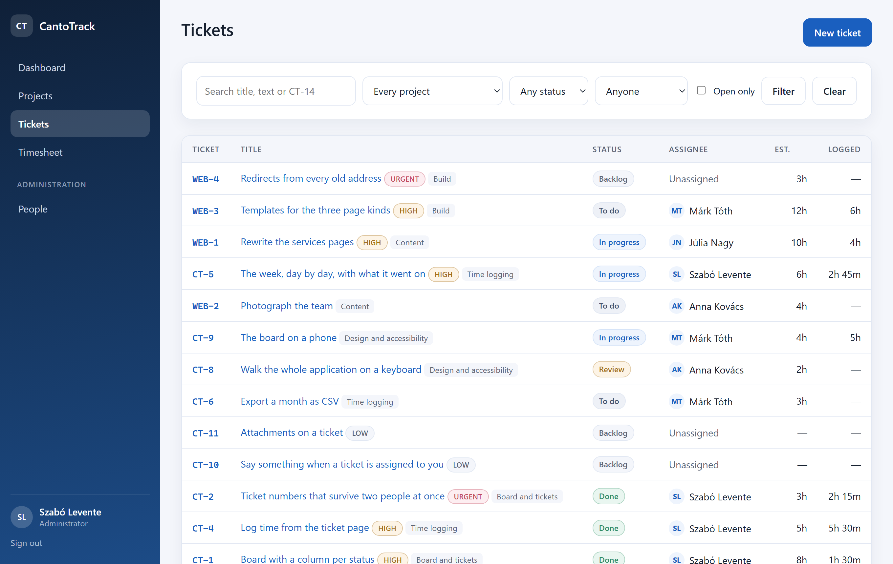

# CantoTrack

An issue tracker with time logging: work is broken down into **projects → epics
→ tickets**, and the hours that go into it are logged against the tickets and
totalled into timesheets.


Written in PHP with Twig and MySQL. No framework: a router, a handful of core
classes and a stylesheet built by concatenating its own sources — small enough
to read in an afternoon and to deploy by copying a folder.

## What it does

**Projects, epics and tickets.** Three levels and no more. A project holds
epics, an epic holds tickets, and a ticket is the thing somebody works on and
logs time against. Ticket numbers are per project (`CT-4`, `WEB-3`) and come
from a counter raised in the same transaction as the insert, so two people
creating a ticket at the same moment cannot end up with the same one.

**A board per project.** A column per status, with the counts in the headers,
and a ticket moved along with one control — which means it also works on a
phone and with a keyboard, neither of which can drag a card.

**A ticket list that filters into the URL**, by project, status, assignee or
text. A filtered list can then be bookmarked, or sent to somebody who gets the
same list you were looking at.



**Time logged where the work was.** Hours go on the ticket, on the day they
happened — which is rarely the day they are typed in, so the date is a field
and not a timestamp. Durations are written the way people say them: `1h 30m`,
`90m`, `1.5h` or `1:30` all mean the same ninety minutes. The estimate sits
next to the total, and says so when the total has passed it.


**A week at a time.** One person's timesheet, day by day, with the entries
under each day and each day measured against a working day. Beside it: where
the hours went by project, and — for an administrator — what everybody else
logged that week. Anybody can open anybody's week, because hours are how a
team's week is understood; changing an entry is a different matter, and stays
with whoever logged it.


**Two roles.** An administrator sets up projects and people; a member works
tickets and logs time. A tracker this size does not earn a permission matrix.

**Accounts that are never deleted.** People are deactivated instead, because
tickets and hours point at them and the history has to keep making sense.
Passwords are generated and shown once, so there is no shared default left to
survive to a live server.

## Running it

Needs PHP 8.4, MySQL or MariaDB, and a web server whose document root is the
`web/` folder.

```
composer install
cp config/config.ini.dist config/config.ini   # then fill in the database
php database/migrate.php                       # creates the database and the tables
php database/seed.php                          # the first administrator, with a printed password
php bin/build_css.php                          # src/View/Css/** -> web/assets/css/app.css
```

Then open the application and sign in with what the seed printed. On a
development machine the address is whatever the folder maps to — set the same
one in `config.ini` as `app.base_url`, because that is what every link is built
from.

### Something to look at

```
php database/seed_demo.php
```

Two projects, five epics, fifteen tickets and a week of hours behind them —
which is what the pictures above are. It prints the passwords of the three
colleagues it invents, and takes `--reset` to start them over. It refuses to
run unless `app.env` is `dev`: it creates accounts that can sign in, and an
account nobody meant to create is exactly the kind of thing that survives to a
live server.

### Checking it

```
php tests/smoke.php --email=you@example.com --password=…
```

It creates a project, an epic and a ticket, logs time against them, reads the
timesheet and deletes all of it again. The one thing it leaves behind is a
deactivated account: the application does not delete people, and the checks do
not make an exception for themselves.

It walks the application over real HTTP rather than calling the controllers:
the login page, a post without a CSRF token, a wrong password, a right one, the
dashboard behind the session, and what a signed-out visitor gets. Most of what
breaks in a PHP application of this shape breaks outside PHP — in the rewrite
rules, the session cookie or a redirect — and none of that is visible to a test
that calls a controller directly.

## Layout

```
bin/            the CSS build, and whatever else is run by hand
config/         config.ini.dist — the real config.ini is never committed
database/       the schema as .sql files, the migration runner and the seeds
docs/           the pictures in this README
src/Core/       config, router, session, CSRF, auth, logging, formatting
src/Controller/ one class per area of the application
src/Model/      repositories: everything that touches the database
src/View/       Twig templates, and the CSS sources under View/Css
tests/          checks that run against a live installation
web/            the document root: the front controller and the built assets
```

## License

MIT. See [LICENSE](LICENSE).
